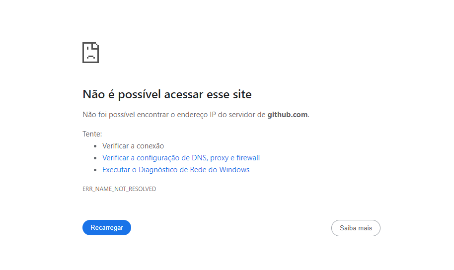
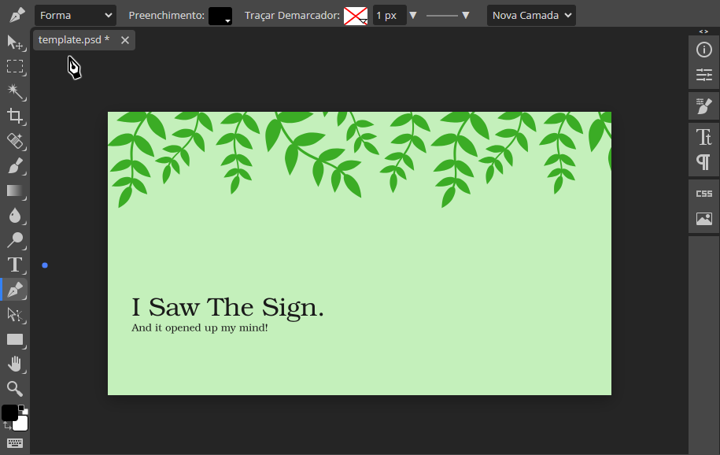
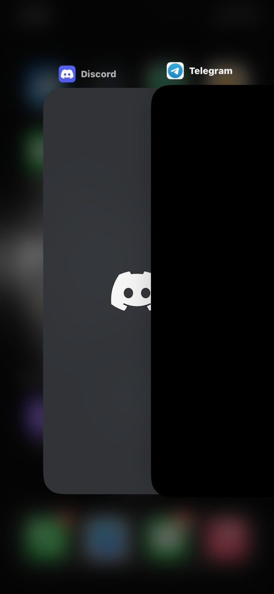

- 1.Visibilidade do status do sistema: Os usuários devem sempre estar cientes do que está acontecendo, seja através de feedback imediato ou indicadores de progresso.

Exemplo: O erro a seguir que é de conexão, não é user friendly.

- 2.Correspondência entre o sistema e o mundo real: O sistema deve falar a linguagem dos usuários, usando termos familiares e conceitos do mundo real para facilitar a compreensão.

Exemplo: Facilidade na utilização das ferramentas de um Photoshop.

- 3.Controle e liberdade do usuário: Os usuários devem ter a liberdade de voltar atrás ou sair de situações indesejadas sem ter que passar por muitos passos complicados.

Exemplo: Ao entrar em um site de jornal por exemplo, é comum aparecer vários tipos de anúncios e configurações que atrapalham a usabilidade.

- 4.Consistência e padronização: Elementos de interface, como botões e menus, devem ser consistentes em todo o sistema para evitar confusão.

Exemplo: Para publicar algo no aplicativo X, os elementos da interface de publicação é consistente em seu layout, cores e escolha de fonte.

- 5.Prevenção de erros: O design deve incluir características que impeçam erros comuns ou forneçam meios fáceis de recuperação caso eles ocorram.

Exemplo: Quando a digitação de uma pesquisa desejada pelo usuário é errada, o próprio Google reconhece o erro e pergunta se a informação mais provável de maneira correta é a certa.  

- 6.Reconhecimento em vez de memorização: Minimize a carga de memória do usuário, tornando as opções e a navegação claras e visíveis, em vez de exigir que os usuários lembrem informações.

Exemplo: Memorização de login do facebook ao sair, para facilidade quando o usuário quiser entrar novamente em sua conta ou adicionar novas contas.

7.Flexibilidade e eficiência de uso: Ofereça atalhos e recursos que permitam aos usuários experientes realizar tarefas de maneira mais rápida e eficiente.

Exemplo: Ao sair de um aplicativo é salvo o atalho na barra atalhos do celular, que ajuda na navegação entre aplicativos.

- 8.Estética e design minimalista: Evite informações desnecessárias ou distrações visuais, buscando uma interface limpa e simplificada.

Exemplo: Sobreposição de informação não necessária em informações de importante uso para o usuário. Os "Canais" na parte de "Status" do WhatsApp são grandes enquanto a informação de principal que seria os status dos contatos é facilmente minimizada.

- 9.Ajuda aos usuários a reconhecerem, diagnosticarem e recuperarem-se de erros: Forneça mensagens de erro claras e sugestões de recuperação para orientar os usuários em caso de equívocos.

Exemplo: Não é apresentado uma forma de corrigir erro ocorrido na tentativa de carregar o aplicativo.

- 10.Ajuda e documentação: Ofereça recursos de suporte, como manuais, tutoriais ou ajuda online, para que os usuários possam encontrar informações quando precisarem.

Exemplo: No aplicativo da Farma Conde não possui documentação da empresa e uma aba de ajuda ao usuário.

